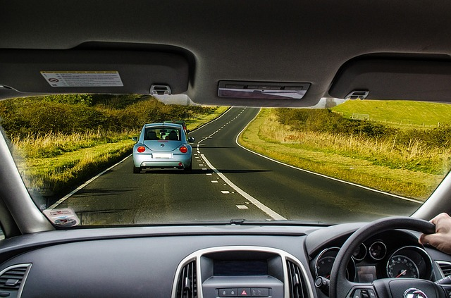

## When to hit the brakes?



 

--- .class #id 

## When to hit the brakes?

To avoid collisions, one has to brake in time.

Stopping distance depends on driving speed. 

Can we find a way to predict stopping distance?

---

## Cars dataset to the rescue

R dataset containing speed and stopping distances for various cars (Ezekiel, 1930).

```{r loaddata}
data(cars)
head(cars,n=1)
```

---

## Building a predictor using cars data

```{r plotdata,echo=FALSE,fig.width=6,fig.height=6}
# Fit linear model
m <- lm(dist ~ speed, data=cars)
# Compute endpoint of fitted line for plot
endpoints_x <- c(min(cars$speed),max(cars$speed))
endpoints_y <- c(m$coef[1]+m$coef[2]*min(cars$speed),m$coef[1]+m$coef[2]*max(cars$speed))
# Plot data and fitted model
plot(x=cars$speed,y=cars$dist,col='skyblue',pch=19,cex=1.5,ylab='Stopping distance (ft)',xlab='Driving speed (mph)')
lines(x=endpoints_x,y=endpoints_y,col='coral',lwd=3)
```


---

## Check out the app

Predict stopping distance at any speed!

[https://lvsh.shinyapps.io/CourseProject](https://lvsh.shinyapps.io/CourseProject)


