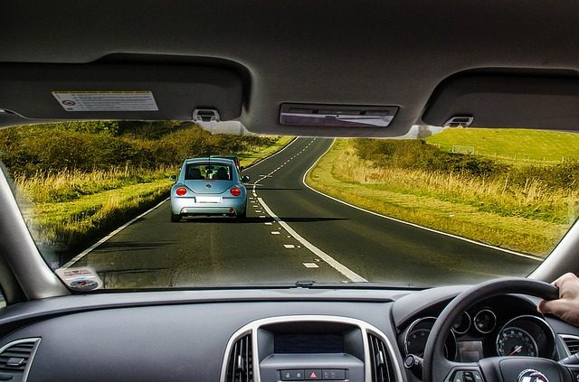

## When to hit the brakes?



 

--- .class #id 

## When to hit the brakes?

To avoid collisions, one has to brake in time.

Stopping distance depends on driving speed. 

Can we find a way to predict stopping distance?

---

## Cars dataset to the rescue

R dataset containing speed and stopping distances for various cars (Ezekiel, 1930).


```r
data(cars)
head(cars,n=1)
```

```
##   speed dist
## 1     4    2
```

---

## Building a predictor using cars data

 


---

## Check out the app

Predict stopping distance at any speed!

[https://lvsh.shinyapps.io/CourseProject](https://lvsh.shinyapps.io/CourseProject)


